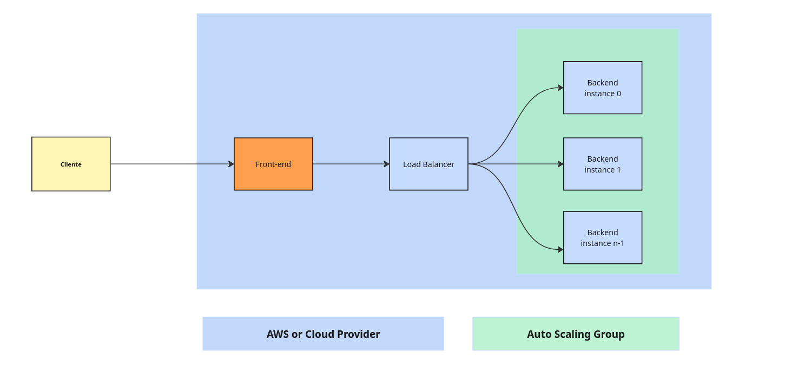

# Predicciones Energéticas GRID - EAFIT

En este repositorio encontrarás los módulos para la predicción de **Consumo** y **Producción** energética que mi equipo y yo desarrollamos para el proyecto GRID-EAFIT. Este repositorio se compone de dos microservicios: **Backend** y **Frontend**, los cuales se comunican mediante HTTP.

---

## ¿Cómo está dividido nuestro proyecto?

El repositorio está estructurado en dos microservicios principales:

- **Backend**: Aquí se encuentran los archivos `.keras` correspondientes a los modelos de *Machine Learning* que desarrollamos para las predicciones energéticas.
- **Frontend**: Contiene los dashboards diseñados para la visualización de los resultados, facilitando al usuario la interpretación de las predicciones realizadas.

---

## ¿Cómo funciona nuestro proyecto?

Actualmente contamos con dos modelos principales:

- **COM-2.0**: Modelo de predicción de **consumo eléctrico** basado en el historial de consumo del usuario. Predice el consumo estimado para el día siguiente utilizando dicha información.

  > Actualmente se están utilizando datos aleatorios como entrada para el modelo, ya que está pendiente la integración con la plataforma web que obtendrá los datos reales del usuario.

- **Weather-1.0**: Modelo de predicción de **producción solar**, basado en variables meteorológicas como radiación solar, temperatura y nubosidad, con el fin de estimar cuánta energía podría generar un sistema fotovoltaico.

  > Este modelo también está recibiendo datos aleatorios temporalmente, hasta que se realice la conexión con las APIs meteorológicas correspondientes.

> Ambos modelos siguen un patrón de nombres específico para su gestión automática:  
**`[a-zA-Z]+-[0-9]+\.[0-9]+`** (por ejemplo: `COM-2.0`, `Weather-1.0`).

---

## ¿Cómo ejecuto el proyecto en local?

El sistema fue diseñado para ser fácilmente mantenible y escalable. Por eso, cada microservicio corre en una **imagen Docker** diferente, orquestadas mediante **Docker Compose**.

### Requisitos previos

- Tener **Docker** y **Docker Compose** instalados y funcionando.
- Si estás en un sistema Unix, asegúrate de que el daemon de Docker esté activo.

### Pasos

1. Configura las variables de entorno en el `Dockerfile` del backend si cambiaste el nombre de los modelos. Asegúrate de que sigan el patrón de nombres mencionado.

2. Ejecuta el siguiente comando (dependiendo de tu versión de Docker):

```bash
docker compose up --build
```

o

```bash
docker-compose up --build
```

3. Abre tu navegador y dirígete a:

```
http://localhost:5173
```

### Recursos útiles

- [Instalar Docker](https://docs.docker.com/engine/install/)
- [Instalar Docker Compose](https://docs.docker.com/compose/install/)

---

## ¿Cómo desplegar el proyecto en la nube?

Utilizamos **AWS EC2** como proveedor de nube, pero puedes usar el proveedor de tu elección. Solo ten en cuenta que los nombres de los servicios podrían variar.

### Pasos para desplegar (ejemplo en Ubuntu):

```bash
apt-get update
apt install nano
```

1. Cambia a la rama adecuada:

```bash
git checkout fixing_routes
```

2. Modifica las direcciones IP en los archivos de frontend:

```bash
nano proyecto_frontend/src/dashboards/EnergyDashboard.jsx
nano proyecto_frontend/src/dashboards/WeatherDashboard.jsx
```

Cambia las URLs por la IP pública de tu instancia, tu **Load Balancer**, o tu **Elastic IP**.

3. Si modificaste el nombre de los modelos, actualiza el `Dockerfile` del backend:

```bash
nano proyecto_backend/Dockerfile
```

4. Ejecuta los microservicios:

```bash
docker-compose up --build
```

Ahora puedes acceder a la aplicación desde tu navegador con la siguiente URL:

```
http://<tu-ip-pública>:5173
```

### Recursos útiles

- [¿Qué es EC2?](https://docs.aws.amazon.com/AWSEC2/latest/UserGuide/concepts.html)
- [¿Qué es un Load Balancer?](https://aws.amazon.com/elasticloadbalancing/)
- [¿Qué es una Elastic IP?](https://docs.aws.amazon.com/AWSEC2/latest/UserGuide/elastic-ip-addresses-eip.html)

---

## Arquitectura recomendada para escalar

Durante las pruebas, identificamos que lo más costoso en tiempo son las peticiones al backend, ya que la ejecución de los modelos toma varios segundos. Esto puede afectar la escalabilidad si no se gestiona correctamente.

### Nuestra propuesta

Implementar una arquitectura orientada a microservicios con balanceo de carga y autoescalamiento:

- El **frontend** debe conectarse a un **Load Balancer**.
- Este Load Balancer debe direccionar a un **Auto Scaling Group** con múltiples instancias de backend.
- De esta forma, a medida que crece la cantidad de usuarios, el tiempo de respuesta se mantiene constante.


### Consideraciones

- Puedes habilitar **multithreading** en las instancias EC2 para mejorar el rendimiento, pero ten en cuenta los costos asociados con procesadores de alto rendimiento.

